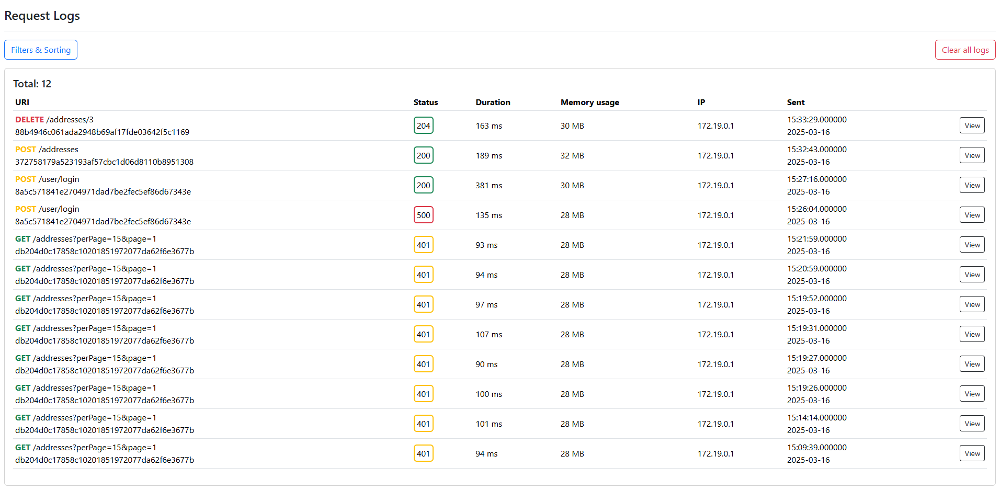

# Request Logger for Laravel
[](https://packagist.org/packages/hryha/laravel-request-logger)
[](https://packagist.org/packages/hryha/laravel-request-logger)
[](https://www.php.net/)
[](https://laravel.com/)
[](LICENSE.md)



## Overview

This package provides middleware that logs incoming HTTP requests and responses in Laravel applications.
You can view your logs through a dedicated panel at `https://your.domain/request-logs`.

## Features

- HTTP request and response logging
- Web-based log viewer interface
- Duplicated requests detection
- Configurable data retention period
- Sensitive data masking
- Support for custom logging fields
- Sampling support - log only a percentage of requests
- Smart filtering - always log slow requests and requests with high memory usage

## Requirements

- PHP 8.2 or higher
- Laravel 11 or higher

## Installation

Install the package via Composer:

```bash
composer require hryha/laravel-request-logger
```

After installing Request Logger, publish its assets and config using the `request-logs:install` Artisan command:

```php
php artisan request-logs:install
```
View the complete configuration options: [here](config/request-logger.php).

After installing Request Logger, you should also run the `migrate` command in order to create the tables needed to store Request Logger's data:

```php
php artisan migrate
```

## Usage

The package provides middleware that can be registered either globally or on specific routes:

```php
// In bootstrap/app.php for global middleware
return Application::configure(basePath: dirname(__DIR__))
    ->withMiddleware(function (Middleware $middleware): void {
        $middleware->prepend([
            \Hryha\RequestLogger\Http\Middleware\RequestLogger::class,
        ])
    })
```

```php
// Or in your routes file for specific routes
Route::get('/user', [UserController::class, 'index'])->middleware(\Hryha\RequestLogger\Http\Middleware\RequestLogger::class);
```

## Upgrading

After upgrading to any new Request Logger version, you should re-publish Request Logger's assets:

```php
php artisan request-logs:publish
```

## Data Pruning

To prevent the `request_logs` table from growing too large, schedule the `request-logs:clear` command to run daily:

```php
use Illuminate\Support\Facades\Schedule;

Schedule::command('request-logs:clear')->daily();
```

The `request-logs:clear` command removes logs older than the number of days specified in your `log_keep_days`
configuration.
To delete all logs, use the --all parameter:

```bash
php artisan request-logs:clear --all
```

## Custom Fields

The Request Logger supports additional custom fields for enhanced logging capabilities.

Use the `RequestLogger::addCustomField(key, value)` method to include additional data in your logs.
Additional data can be added from anywhere in the application using this code:

```php
use Hryha\RequestLogger\RequestLogger;

resolve(RequestLogger::class)->addCustomField('user_id', Auth::id());
```
also, to filter logs by this field, you can add this field to the settings

```dotenv
REQUEST_LOGGER_CUSTOM_FIELDS="user_id,other_field"
```

## Sampling Configuration

To reduce storage usage and improve performance on high-traffic applications, you can configure Request Logger to log only a percentage of requests.

### Basic Sampling

Enable sampling in your `.env` file:

```dotenv
# Enable sampling
REQUEST_LOGGER_SAMPLING_ENABLED=true
# Log only 0.5% of successful requests (2xx)
REQUEST_LOGGER_SAMPLING_2XX=0.5
# Log 50% of redirects (3xx)
REQUEST_LOGGER_SAMPLING_3XX=50
# Log all client errors (4xx)
REQUEST_LOGGER_SAMPLING_4XX=100
# Log all server errors (5xx)
REQUEST_LOGGER_SAMPLING_5XX=100
```

**Note**: Sampling rates support up to 2 decimal places (e.g., 10.25%). Values with more precision are automatically rounded.

### Smart Filtering

Always log critical requests regardless of sampling rate:

```dotenv
# Always log requests slower than 500ms
REQUEST_LOGGER_ALWAYS_LOG_SLOW=500
# Always log requests using more than 30MB memory
REQUEST_LOGGER_ALWAYS_LOG_HEAVY_MEMORY=30
```

### How Sampling Works

When sampling is enabled:

1. **Ignored paths** are checked first (never logged)
2. **Smart filters** are applied (slow requests, high memory usage)
3. If no smart filter matches, **sampling rate** is applied randomly
4. A value of `0` means never log, `100` means always log

## Ignoring Paths

Configure paths to ignore by setting `REQUEST_LOGGER_IGNORE_PATHS` in your `.env` file:

```dotenv
REQUEST_LOGGER_IGNORE_PATHS="telescope*,horizon*,nova-api*"
```

These paths will never be logged, regardless of sampling configuration.

## Panel authorization

Be sure to protect this panel from unauthorized access. We recommend using [Basic Auth](https://github.com/vaniok010/laravel-simple-basic-auth) middleware or something similar.
To do this, add an auth `middleware` in `config/request-logger.php`

``` php
'middleware' => [
    \Hryha\SimpleBasicAuth\SimpleBasicAuth::class,
],
```

## Testing

Run the test:

``` bash
composer test
```
