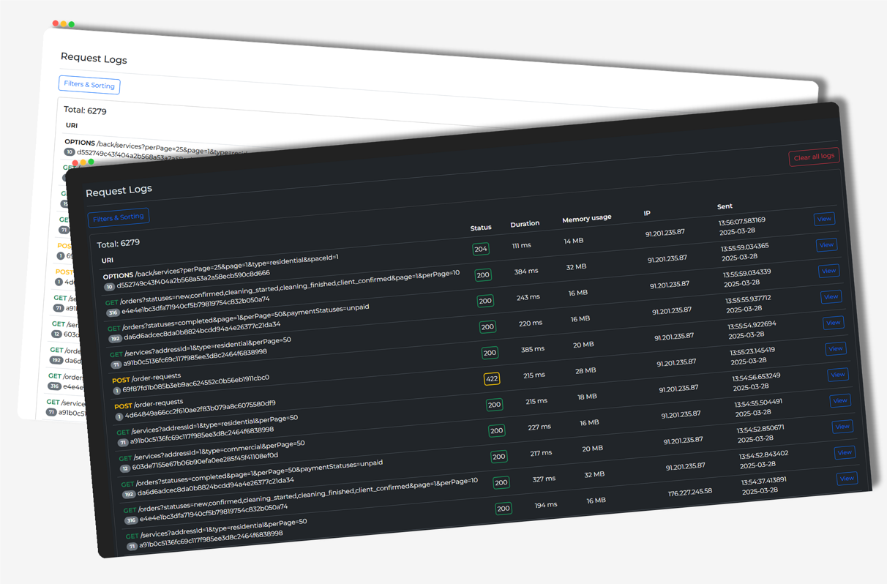

# Request Logger for Laravel
[](https://packagist.org/packages/hryha/laravel-request-logger)
[](https://packagist.org/packages/hryha/laravel-request-logger)
[](https://www.php.net/)
[](https://laravel.com/)
[](LICENSE.md)



## Overview

This package provides middleware that logs incoming HTTP requests and responses in Laravel applications.
You can view your logs through a dedicated panel at `https://your.domain/request-logs`.

## Features

- HTTP request and response logging
- Web-based log viewer interface
- Duplicated requests
- Configurable data retention period
- Sensitive data masking
- Support for custom logging fields

## Requirements

- PHP 8.2 or higher
- Laravel 11 or higher
- MySQL 5.7 or higher

## Installation

Install the package via Composer::

```bash
composer require hryha/laravel-request-logger
```

Run the database migrations:

```php
php artisan migrate
```

Optionally, publish the package's configuration file:

```bash
php artisan vendor:publish --provider="Hryha\RequestLogger\RequestLoggerServiceProvider" 
```

View the complete configuration options: [here](config/request-logger.php).

The package provides middleware that can be registered either globally or on specific routes.

```php
// In bootstrap/app.php for global middleware
return Application::configure(basePath: dirname(__DIR__))
    ->withMiddleware(function (Middleware $middleware): void {
        $middleware->prepend([
            \Hryha\RequestLogger\Http\Middleware\RequestLogger::class,
        ])
    })
```

```php
// Or in your routes file for specific routes
Route::get('/user', [UserController::class, 'index'])->middleware(\Hryha\RequestLogger\Http\Middleware\RequestLogger::class);
```

## Data Pruning

To prevent the `request_logs` table from growing too large, schedule the `request-logs:clear` command to run daily:

```php
$schedule->command('request-logs:clear')->daily();
```

The `request-logs:clear` command removes logs older than the number of days specified in your `log_keep_days`
configuration.
To delete all logs, use the --all parameter:

```bash
php artisan request-logs:clear --all
```

## Custom Fields

The Request Logger supports additional custom fields for enhanced logging capabilities.

Use the `RequestLogger::addCustomField(key, value)` method to include additional data in your logs.
Additional data can be added from anywhere in the application using this code:

```php
resolve(RequestLogger::class)->addCustomField('user_id', Auth::id());
```
also, to filter logs by this field, you can add this field to the settings

```dotenv
REQUEST_LOGGER_CUSTOM_FIELDS="user_id,other_field"
```

## Ignoring Responses by Status Code

Configure status codes to ignore by setting `REQUEST_LOGGER_IGNORE_RESPONSE_STATUSES` in your `.env` file.
The setting accepts both status ranges and specific status codes:

```dotenv
REQUEST_LOGGER_IGNORE_RESPONSE_STATUSES="[[100, 299], 301, 302]"
```

This configuration will ignore logs for responses with status codes between `100-299`, as well as `301` and `302`
responses.

## Panel authorization

Be sure to protect this panel from unauthorized access. We recommend using [Basic Auth](https://github.com/vaniok010/laravel-simple-basic-auth) middleware or something similar.
To do this, add an auth `middleware` in `request-logger.php`

``` php
'middleware' => [
    \Hryha\SimpleBasicAuth\SimpleBasicAuth::class,
],
```

## Testing

Run the test:

``` bash
composer test
```
